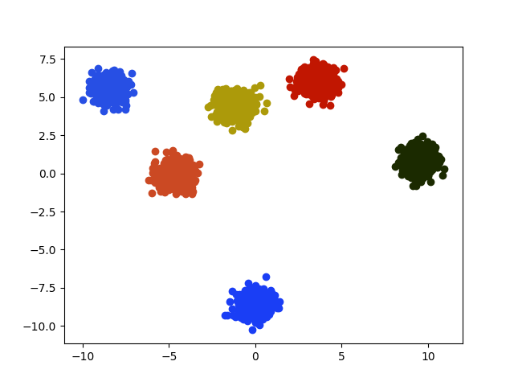
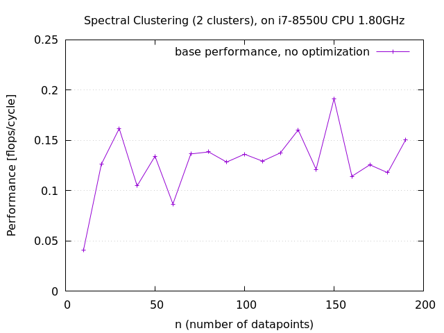

# ASL project: Spectral Clustering

# Table of Contents

1. [Introduction](#Introduction)
2. [Project structure](#Structure)
3. [Installation](#Installation)
4. [Commands](#Commands)
5. [Performance plots](#Performance)
6. [Todo](#Todo)

<a name="Introduction"></a>
## Introduction


This project implements the Spectral Clustering algorithm presented in the following paper: https://arxiv.org/abs/0711.0189.

It makes use of various optimization techniques to reach its maximal performance , such as:
- TODO

 


<a name="Structure"></a>
## Project structure


```
team018/
│   README.md
│   Makefile 
│   contruct_graph.c 
│   kmeans.c
│   norms.c
│   main.c (assemble pieces of construct_graph, kmeans, norms)
│   util.c (helper methods)
│   instrumentation.c (timing infrastucture)  
│
└───datasets/ (the datasets on which the algorithm is executed)
│   
└───output/ 
    └───graphs/ (the graphs related to performance)
    └───measurements/ (performance measurements)
    └───validation/ (the visualization images of the algorithm)
    perf.txt (measurements)
    ... 
│ 
└───scripts/ 
    └───graphs/ (to generate performance graphs)
    └───validation/ (to generate cluster visualizations)
    make_perf_data.sh (generate the dataset perf_data/)
    perf_checker.sh (generate the performance based on perf_data/)
│   
└───requirements/
    ...
```

<a name="Installation"></a>
## Installation

On linux, run: `./requirements/install.sh`

#### Python requirements

`pip install -r requirements/python-requirements.txt`

#### C requirements

##### linux

Openblas compiler: `git clone https://github.com/xianyi/OpenBLAS.git`, `cd openblas`, `make`

`sudo apt-get install libopenblas-dev`

`sudo apt-get install $(cat requirements/apt-requirements.txt)`

lapack: `sudo apt-get install liblapacke-dev`

##### macOS

lapack: `brew install openblas`


<a name="Commands"></a>
## Commands

**The following commands assume working directory is team018/ and filenames do not require to specify paths.**


Compile with `make`


##### Algorithm 

- `./clustering <path/Dataset.txt> <# of clusters> <path/Output.txt>`, returns the clusters partitions (indices), the clusters sizes,
the runtime, and the flops for each method.
- e.g.: 
- ` ./clustering ./datasets/test_points/points.txt 2 out.txt
`

##### Visualization

- interactive shell: `python3 scripts/validation/validation.py`
    - just specify names, input path is **/datasets/test_points/**, output is **/output/validation/**
- parametrize execution: `TODO`

**To generate data sets (interactive):**

- `generate_gaussian.py`
- `sample_gaussian.py`

##### Performance

- generate dataset in datasets/: `./scripts/make_perf_data.sh` (change max i and intervals in file)
- measure algorithm's performance from "datasets/perf_data" and produce performance in /output/measurements/: `./scripts/perf_checker.sh <file_name.txt>`  e.g. `./scripts/perf_checker.sh base_perf_1000.txt`
- generate performance's graph in eps (format), input in output/, output generated in/output/graphs/:

    - `gnuplot -c "scripts/graphs/base_performance.gp" "'<output_file_eps>'" "'<input_file>'",
`, e.g.
    - `gnuplot -c "scripts/graphs/base_performance.gp" "'base_perf_1000.eps'" "'base_perf_1000.txt'"
`

<a name="Performance"></a>
## Performance plots

#### Coarse base performance ( n < 4500)

 

#### Naive base performance ( n < 200)

 


<a name="Todo"></a>
## TODO

- Benchmark alternatives (dlib, subalgorithms)
  - sequential kmeans by Northwest University: https://github.com/serban/kmeans.git (remove first line of our dataset)
  - scikit-learn
  - MATLAB
                                           
- Optimization:
  - Algorithm-level 
    - direct computation of Laplacian (Pouya)
    - more efficient k-means algorithm (Leo, Zuowen, Pouya) (all should read)
  - Unrolling + accumulators for l2 norm (Zuowen)
  - Reduce range of exp + use Taylor expansion (Pouya)
  - Analyze cache behavior of find_nearest_cluster_index (Julien)
  - roofline plots
  - Case distinction for l2 (no unroll for small dim)
  - debug arpacke for high-dim, (actually also low dim. i.e.points.txt)
  - normalization as preprocessing
  - start vectorization
  - start plannning, what/how to present - lead to priorities of the works in the following weeks. (actually only 2)
